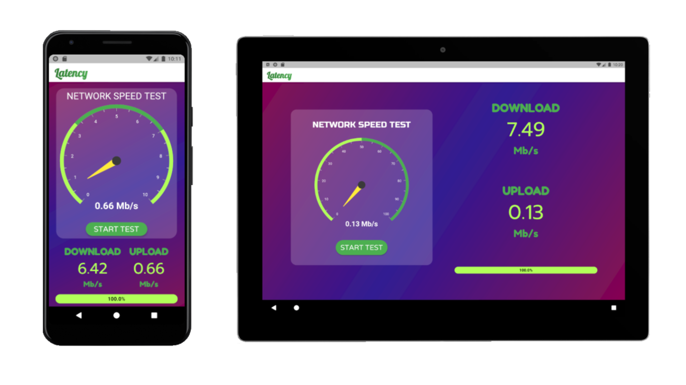

# latency

A network speed test application built on flutter and network speed test package ( 3rd party application).



## phone
 

## tablet


## How does it work


DOWNLOAD SPEED
Receiving data packets from a server for 20s and increasing the size of the packets periodically, we can calculate the download speed by averaging all the download speeds.

UPLOAD SPEED
Sending data packets to a server for 20s and increasing the size of the packets periodically, we can calculate the upload speed by averaging all the upload speeds.

Servers - 3rd Party

uploadServer = 'http://ipv4.ikoula.testdebit.info/'

downloadServer = 'http://speedtest.tele2.net/1MB.zip'


## Getting Started
Clone the files and run the following command
```
flutter pub get
flutter run
```
